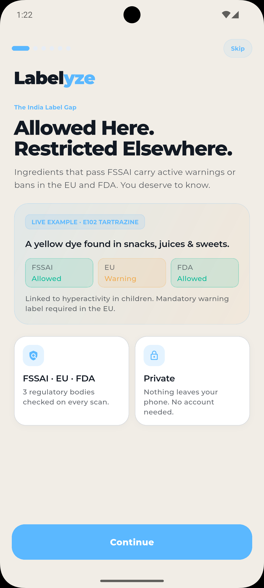
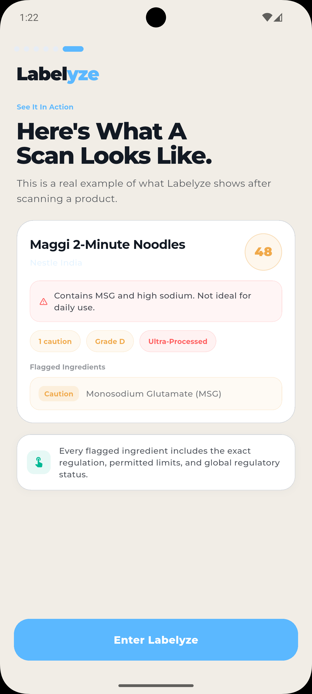
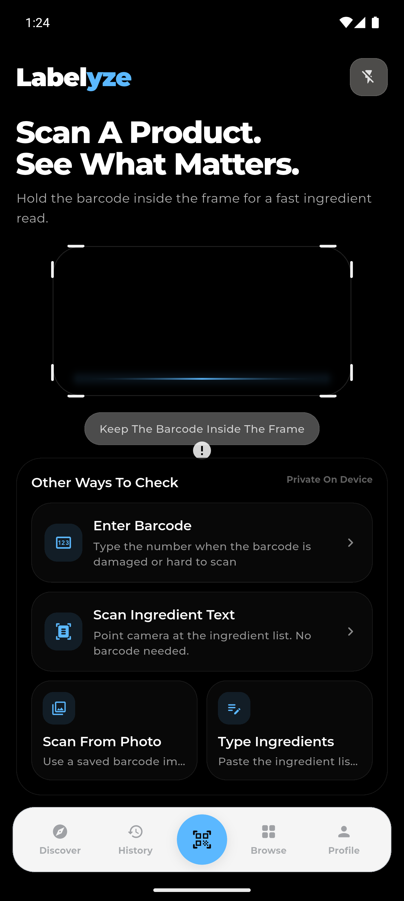
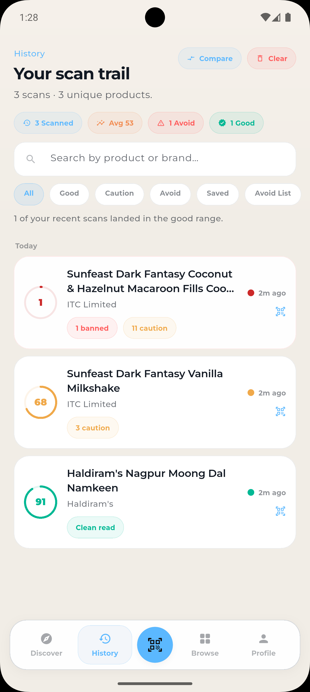
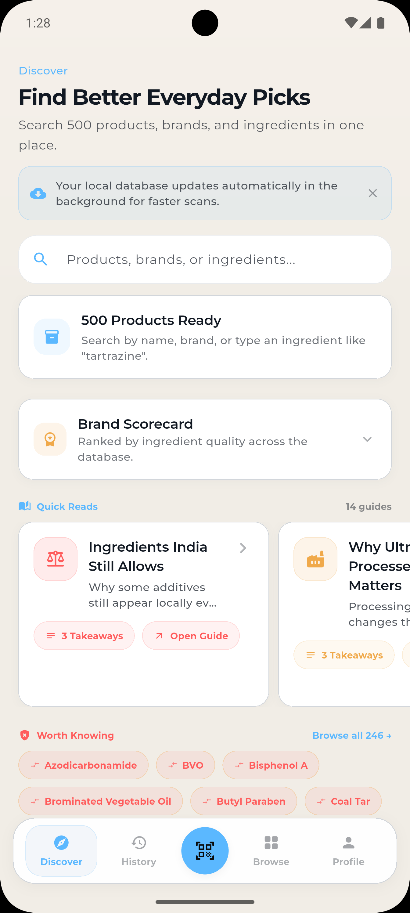
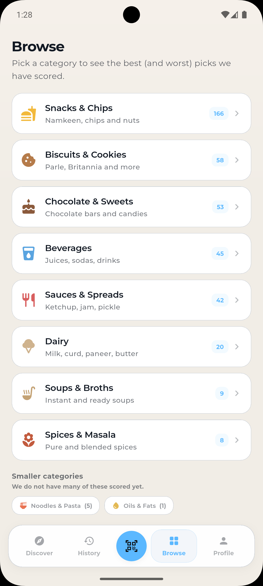
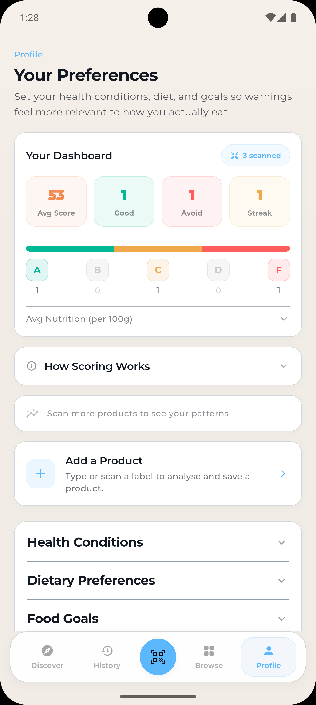

# Labelyze

India’s first global-standard product scanner for food, medicine, cosmetics, and baby products.

Labelyze helps people understand what they buy by checking ingredients against **FSSAI, EU, and FDA standards** and turning labels into clear, practical insights.

  <a href="https://labelyze.in">Website</a> •
  <a href="https://github.com/samyyy2311/Labelyze.in/releases/latest">Download APK</a>

---

## Why Labelyze

Many products approved locally may carry warnings, usage limits, or restrictions in other countries.

Most people read nutrition labels. Very few understand ingredient labels.

Labelyze closes that gap by helping users scan products and instantly understand what is inside, what regulators say, and what may matter personally.

---

## What It Does

### Barcode Scan

Point your camera at a barcode. Results load instantly from the on-device database with no internet required.

### Ingredient Scan

Use OCR to read ingredient lists directly from packaging when no barcode is available.

### Manual Entry

Paste or type ingredients from online listings, damaged packaging, or imported products.

---

## Core Features

- 500+ Indian products in the offline database  
- Multi-regulator checks: FSSAI, EU, FDA  
- Smart scoring with plain-English explanations  
- Nutrition analysis with HIGH / MED / LOW context  
- Health condition and allergen personalization  
- Scan history and saved products  
- Product comparison tools  
- Light mode and dark mode  
- Fully offline experience  
- No account required  
- Nothing leaves your phone  

---

## Product Tour

<table align="center">
<tr>
<td align="center">
 
<b>Onboarding</b> 
Regulatory Gap
</td>
<td align="center">
 
<b>Onboarding</b> 
Real Scan Example
</td>
<td align="center">
 
<b>Scanner</b> 
Barcode & Ingredient Scan
</td>
</tr>

<tr>
<td align="center">
 
<b>History</b> 
Recent Scan Trail
</td>
<td align="center">
 
<b>Discover</b> 
Better Everyday Picks
</td>
<td align="center">
 
<b>Browse</b> 
Category Rankings
</td>
</tr>

<tr>
<td align="center" colspan="3">
 
<b>Profile</b> 
Preferences & Dashboard
</td>
</tr>
</table>

---

## Download

Get the latest APK from Releases:

https://github.com/samyyy2311/Labelyze.in/releases/latest

The app can automatically check for APK and database updates from this repository.

---

## Database Updates

The product database (`labelyze_india.db`) updates independently from the app.

New releases are published using tags such as:

`db-YYYY-MM-DD`

The app can download updates automatically in the background.

---

## Roadmap

### v1.1

- Non-food scoring fixes for cosmetics and household products  
- Ingredient watchlist for custom avoids  
- Better not-found barcode flow with OCR suggestions  
- Shareable scan result cards for WhatsApp and social sharing  

### v2.0

- Label Lie Detector for misleading front-pack claims  
- Better product alternatives for low scores  
- Monthly insights and progress reports  
- Family profiles with separate preferences  
- Contribution tracking for missing products  

### v3.0

- AR shelf scanning while shopping  
- Medicine scanner  
- Cosmetics scanner  
- Price vs health score comparisons  
- Lightweight community reviews  

---

## Built For India

Designed around Indian shelves, Indian brands, and Indian buying habits.

---

## Privacy First

- No account needed  
- No unnecessary tracking  
- Offline-first design  
- Nothing leaves your phone unless you choose to share it  

---

## Status

Actively building and improving.

---
